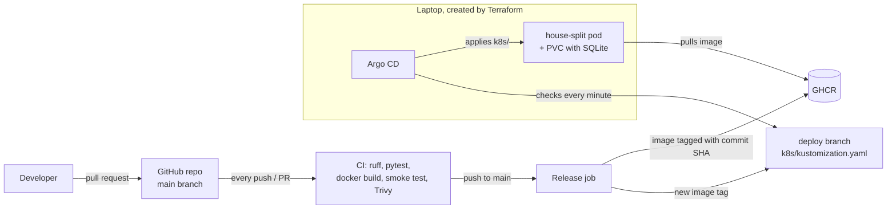

# House Split

House Split is a small web app for keeping track of shared expenses between
housemates. It shows who paid and who owes money.

We are two housemates in Stockholm, and we built this as part of the DD2482
DevOps course at KTH. The main focus of the project is the pipeline around the
app: changes are checked in CI, built into a Docker image, and deployed to a
Kubernetes cluster running on our laptop. Argo CD handles deployment using
GitOps, and Terraform sets up the cluster and Argo CD. This means we can
recreate the setup with one command.

The project report is in [docs/report.pdf](docs/report.pdf).

## Architecture



1. Pull requests run the CI job. It runs linting and tests, builds the Docker
   image, checks the container with a smoke test, and scans it with Trivy.
   `main` is protected, so these checks have to pass before a PR can be merged.
2. After a merge, the release job builds images for amd64 and arm64 and pushes
   them to GitHub Container Registry (GHCR), tagged with the commit SHA.
3. The job also updates the image tag in `k8s/kustomization.yaml` on the
   `deploy` branch. CI is the only thing that writes to this branch, so there
   are no bot commits on `main`.
4. Argo CD runs in the cluster and watches the `deploy` branch. When it sees a
   new tag, it deploys that version.

The cluster runs on a laptop and does not have a public address, so GitHub
cannot push a deployment to it. Instead, Argo CD pulls the desired state from
GitHub. CI does not need credentials to access the cluster.

## Run everything

You need Docker Desktop running, Terraform 1.6 or newer, `kubectl`, and `make`.
Port 8080 must be free.

```sh
make up        # creates the kind cluster, installs Argo CD and registers the app
make status    # wait until the app is Synced / Healthy
```

The first `make up` takes a few minutes while it downloads the images. Then open
http://localhost:8080.

```sh
make argocd    # prints the admin password and opens a tunnel to the Argo CD UI
```

Open https://localhost:8081 and log in as `admin`. The browser will show a
certificate warning; that is expected for a local install. The password is
new each time the cluster is created.

```sh
make down      # deletes the cluster and everything in it
```

## Things to try

- **Deploy a change:** Change something in the app, for example the subtitle in
  `app/templates/index.html`, then open a PR and merge it. After a few minutes,
  Argo CD should show a new sync from the `deploy` branch and the page should
  show the change. The data stays because it is stored in the PersistentVolumeClaim,
  not in the pod.
- **Self-healing:** Delete the app deployment with `kubectl`. Argo CD notices
  that the cluster no longer matches Git and creates it again.
  ```sh
  kubectl --context kind-house-split -n house-split delete deployment house-split
  ```
- **Rollback:** Revert a commit on `main`. CI builds the previous code again,
  and Argo CD deploys it as a normal change.

## Repository layout

| Path | What it is |
|---|---|
| `app/`, `tests/` | the Flask app and its tests |
| `Dockerfile` | the image (runs gunicorn as a non-root user) |
| `.github/workflows/ci.yml` | CI (test, docker) and the release job |
| `.github/dependabot.yml` | weekly dependency updates |
| `k8s/` | Deployment, Service, PVC and kustomization for the app |
| `infra/` | Terraform: kind cluster, Argo CD (Helm) and the Argo CD Application |
| `Makefile` | `up`, `status`, `argocd`, `down` |

## Quality and security

- **ruff** checks linting and formatting, and **pytest** runs the tests on every
  push and pull request.
- **Trivy** scans the image and fails the build for critical vulnerabilities
  that have a fix. The action is pinned to a commit SHA because tags can be
  moved.
- **Dependabot** opens pull requests for updates to Python packages, the base
  image, GitHub Actions, and Terraform providers.
- **Branch protection** on `main` means changes go through a pull request and
  the CI checks must pass.
- GitHub **secret scanning** and push protection are enabled for the repository.

## Run the app without Kubernetes

You need Python 3.10 or newer.

```sh
python -m venv .venv
source .venv/bin/activate
pip install -r requirements-dev.txt
flask --app app.main run
```

Then open http://localhost:5000. Data is saved in `data/house.db`; set `DB_PATH`
to use a different file.

To run the tests and lint checks:

```sh
pytest
ruff check .
ruff format --check .
```

## How the app works

- Add the housemates.
- Add an expense with a description, amount, payer, and the people sharing it.
  If nobody is selected, the whole house shares the expense.
- The app shows each person's balance and a short list of payments that would
  settle everything. Amounts are stored in cents to avoid rounding errors.

The settling logic is in `app/balances.py`. It matches the person who owes the
most with the person who is owed the most, and repeats until everyone's balance
is zero. With n people, this takes at most n - 1 payments.

| Method | Path | What it does |
|---|---|---|
| GET | `/` | the page |
| POST | `/people` | add a housemate |
| POST | `/expenses` | add an expense |
| POST | `/expenses/<id>/delete` | delete an expense |
| GET | `/api/summary` | everything as JSON |
| GET | `/health` | health check |

## Use of AI

We used Claude as a helper, mainly when getting the first version of the app
and project setup in place. It suggested initial code and explained tools or
errors when we got stuck.

We chose the app and the pull-based GitOps design, worked through and
understood the code before committing it, and made the DevOps setup decisions
ourselves. We ran the pipeline and deployment on our own, tested the app and
checked that data survived a pod replacement. When things broke, we debugged
and fixed them, sometimes using AI explanations to help us understand the
problem. The final setup and the work to get it running were ours.
